# Comparison-Between-Multiple-Classification-Algorithms-on-Continuous-Datasets

_By_

_Ibrahim Alzekri_

_Abdullah Alkhalifah_

## **Introduction**

While starting this project, we discussed on what problem we should work on (dataset), we choose one (covid cases worldwide) but came up with the problem on what choice of algorithms we should use? So instead of working on one dataset with few algorithms, we shifted our route to working on popular datasets to experiment with many classification algorithms to see what yielded better (and consistent) classification results.

## **Datasets Used**

We choose fairly popular datasets, since our goal is to judge classification algorithms. We worked on:

- Iris dataset: multiclass - fairly easy to classify
- Wine dataset: multiclass
- Diabetes dataset: binary - complex decision boundaries

## **Method Used**

Here are the models we used, a star on the name denotes that we implemented it from scratch.

- Gaussian Naïve Bayes\*
- Support Vector Machines with Radial Basis Function as kernels
- Boosting: Adabooost
- K Nearest Neighbors\*
- Linear Discriminant Analysis

## **Simulation Results**

### Iris Dataset:

#### GNB 
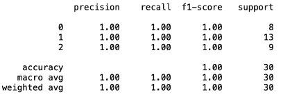

#### KNN
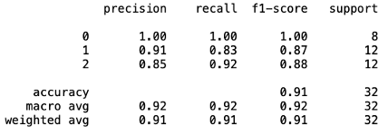

#### SVM 
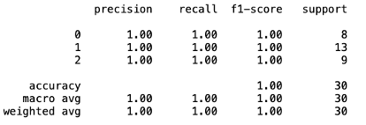

#### Adaboost
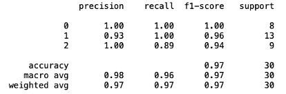

#### LDA
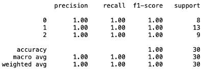

#### Comparison
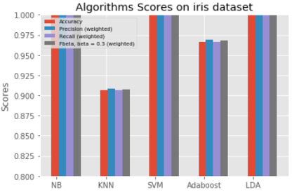

We can observe that all of the models used give very good results, this is due to the nature oof the classification and how the decision boundaries are non-complex.

We denote that KNN, the lesser intelligent model scored the worst result on all metrics as expected. Also, it looks like our problem really made use of the assumption of normal distribution as can be seen in the excellent results we obtained from GNB and LDA

### Wine Dataset:

#### GNB 
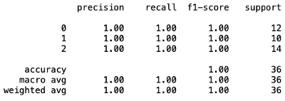

#### KNN
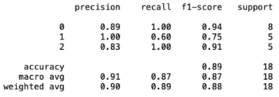

#### SVM 
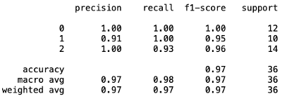

#### Adaboost
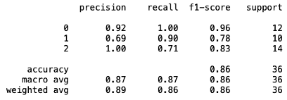

#### LDA
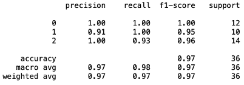

#### Comparison
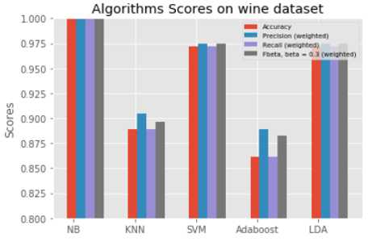

Interestingly, we observe that GNB yielded perfect results on the test set, and Adaboost, with 250 estimators overfit the data and got the lowest results, even lower than KNN. Note that all hyper-parameters were fixed for all datasets used.

### Diabetes Dataset:

GNB KNN

 

SVM Adaboost

 

LDA

Comparison

As expected with such complex decision boundary (even though it&#39;s a binary classification) the accuracies obtained are much lower than previous datasets. Here is where the benefit for SVMs with RBF kernels comes to play, as it comes with the best metrics results for this problem. Keep in mind that the hyper-parameters were fixed, adjusting them for this problem will surely yield better results. Again, KNN were the worst and probably shouldn&#39;t be used for real life complex problems.
